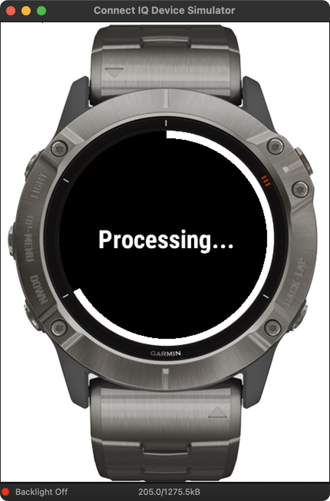

# Garmin Watch QR Code Viewer

I've built this project to check out Garmin SDK and Monkey C language.
I also wanted to see how far I can go calculating stuff entirely on the device.
I didn't find any app on the CIQ store that would be able to generate qr image without extra hassla and talking to the server (now I see why).
So I created this app, which generates qr code out of alphanumeric string, caches it and displays it on the screen.

Turned out, it's really inconvenient to perform such complicated task even for a code with a single symbol in it, as it takes a lot of resources.
So I had to split qr code builder into chunks that could be continued on every (50ms) timer callback.

I used [pyqrcode](https://github.com/mnooner256/pyqrcode) to copy builder algorithms.
And I used [Barcode-Wallet](https://github.com/macherel/Barcode-Wallet) approach to rendering qr code with a font.

At the moment, qr code input string is hardcoded inside `QRCodeApp.mc`, because it seems that I can't enter it if from the CIQ phone app if the watch app is installed manually and not from the store.

|  |  |  |  | 
| - | - | - | - |
|  |  |  |  |

In the end, I'm using it to store my EU vaccination passport in case I don't have my phone with me :)
